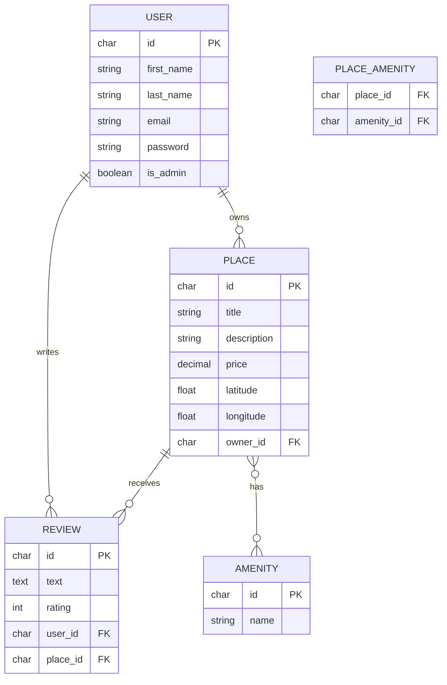

# HBnB Evolution — Entity-Relationship Diagram

## Relationships

| From | To | Type | Notes |
|---|---|---|---|
| USER | PLACE | One-to-many | A user can own many places; each place has one owner (`owner_id`) |
| USER | REVIEW | One-to-many | A user can write many reviews; each review has one author (`user_id`) |
| PLACE | REVIEW | One-to-many | A place can receive many reviews; each review targets one place (`place_id`) |
| PLACE | AMENITY | Many-to-many | Managed through the `PLACE_AMENITY` join table |

## Constraints

- `USER.email` — unique
- `AMENITY.name` — unique
- `REVIEW.rating` — integer between 1 and 5
- `REVIEW (user_id, place_id)` — unique composite (one review per user per place)
- `PLACE_AMENITY (place_id, amenity_id)` — composite primary key